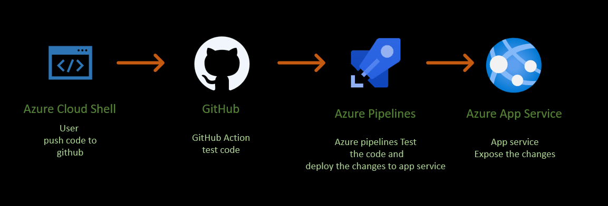
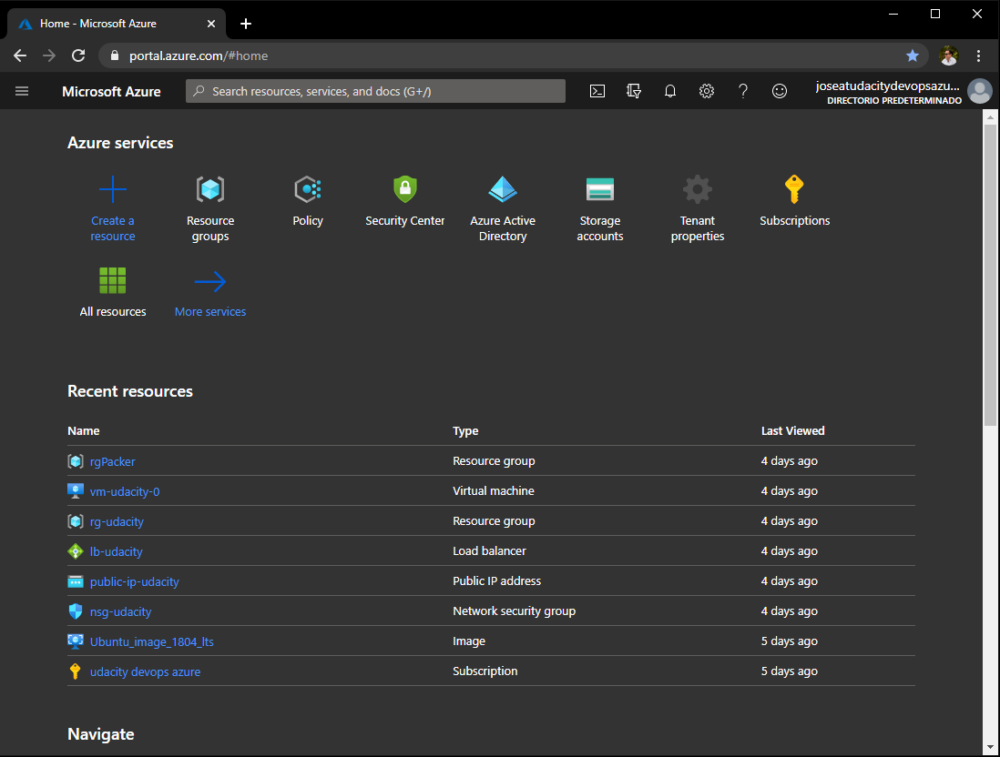
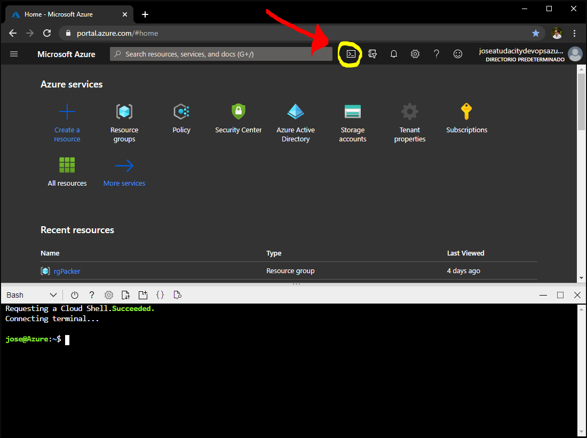
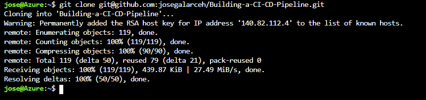
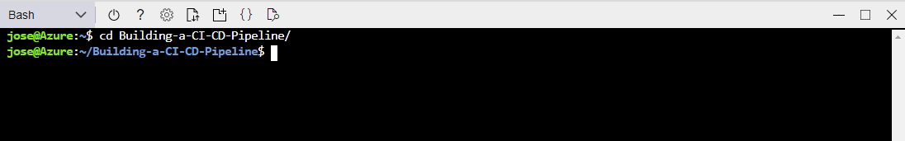

# Overview

In this project, you will build a Github repository from scratch and create a scaffolding that will assist you in performing both Continuous Integration and Continuous Delivery. You'll use Github Actions along with a Makefile, requirements.txt and application code to perform an initial lint, test, and install cycle. Next, you'll integrate this project with Azure Pipelines to enable Continuous Delivery to Azure App Service.

## Project Plan

It is critical to have an effective project plan and task tracking, In this section you find:

* A [Trello](https://trello.com/b/7QrYdgzR/udacity-building-a-ci-cd-pipeline) board for the project
* A [spreadsheet](https://github.com/josegalarceh/Building-a-CI-CD-Pipeline/blob/main/Udacity-Building-a-CI-CD-Pipeline-Q1-2021.xlsx) that includes the original and final project plan

## Instructions



## Deploy the app in Azure Cloud Shell

Go to the azure portal in your browser:
```
portal.azure.com
```
 

In the Azure Portal, select Azure Cloud Shell:

 

In Azure Cloud Shell, clone the repo:
```
git clone git@github.com:josegalarceh/Building-a-CI-CD-Pipeline.git
```
 

Go to the repository directory:
```
cd Building-a-CI-CD-Pipeline
```


Setup virtual environment:
```
make setup
```


* Project running on Azure App Service

* Project cloned into Azure Cloud Shell

* Passing tests that are displayed after running the `make all` command from the `Makefile`

* Output of a test run

* Successful deploy of the project in Azure Pipelines.  [Note the official documentation should be referred to and double checked as you setup CI/CD](https://docs.microsoft.com/en-us/azure/devops/pipelines/ecosystems/python-webapp?view=azure-devops).

* Running Azure App Service from Azure Pipelines automatic deployment

* Successful prediction from deployed flask app in Azure Cloud Shell.  [Use this file as a template for the deployed prediction](https://github.com/udacity/nd082-Azure-Cloud-DevOps-Starter-Code/blob/master/C2-AgileDevelopmentwithAzure/project/starter_files/flask-sklearn/make_predict_azure_app.sh).
The output should look similar to this:

```bash
udacity@Azure:~$ ./make_predict_azure_app.sh
Port: 443
{"prediction":[20.35373177134412]}
```

* Output of streamed log files from deployed application

> 

## Enhancements

<TODO: A short description of how to improve the project in the future>

## Demo 

<TODO: Add link Screencast on YouTube>


