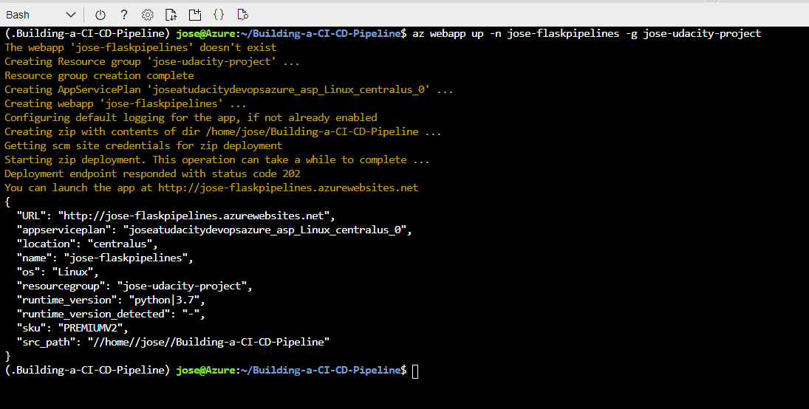

# Overview

In this project, you will build a Github repository from scratch and create a scaffolding that will assist you in performing both Continuous Integration and Continuous Delivery. You'll use Github Actions along with a Makefile, requirements.txt and application code to perform an initial lint, test, and install cycle. Next, you'll integrate this project with Azure Pipelines to enable Continuous Delivery to Azure App Service.

In the folder [evidence](https://github.com/josegalarceh/Building-a-CI-CD-Pipeline/tree/main/evidence) you will find the evidence required from udacity project.

## Project Plan

It is critical to have an effective project plan and task tracking, In this section you find:

* A [Trello](https://trello.com/b/7QrYdgzR/udacity-building-a-ci-cd-pipeline) board for the project
* A [spreadsheet](https://github.com/josegalarceh/Building-a-CI-CD-Pipeline/blob/main/Udacity-Building-a-CI-CD-Pipeline-Q1-2021.xlsx) that includes the original and final project plan

## Instructions


## Deploy the app in Azure Cloud Shell

Go to the azure portal in your browser:
```
portal.azure.com
```
 

In the Azure Portal, select Azure Cloud Shell:

 

In Azure Cloud Shell, clone the repo:
```
git clone git@github.com:josegalarceh/Building-a-CI-CD-Pipeline.git
```
 

Go to the repository directory:
```
cd Building-a-CI-CD-Pipeline
```


Setup virtual environment:
```
make setup
```


Activate the virtual environment:
```
source ~/.Building-a-CI-CD-Pipeline/bin/activate
```


Install dependencies and run lint in the virtual environment:
```
make all
```


In order to validate the application before deploy to app service, start the application in the virtual environment:
```
python app.py
```


Open other Cloud Shell:


In the new Cloud Shell, go to the repository directory and test that the app is working:
```
cd Building-a-CI-CD-Pipeline
./make_prediction.sh
```


Close the second cloud console, and press "Ctrl + c" to stop the local app in the first console:


## Deploy the app to an Azure App Service
Now is time to deploy the app to an azure app service...

Create an App Service in Azure. In this example the App Service is called jose-flaskpipelines and the resource group is called jose-udacity-project. In the first Cloud Console run the follow command, the result take a few minutes:

```
az webapp up -n jose-flaskpipelines -g jose-udacity-project
```


This is the webapp on the azure portal:


Next, create and configure the pipeline in Azure DevOps. More information on this process can be found [here](https://docs.microsoft.com/en-us/azure/devops/pipelines/ecosystems/python-webapp?view=azure-devops&WT.mc_id=udacity_learn-wwl). The basic steps to set up the pipeline are:

- Go to [https://dev.azure.com](https://dev.azure.com) and sign in.
- Create a new private project.
- Under Project Settings create a new service connection to Azure Resource Manager, scoped to your subscription and resource group.
- Create a new pipeline (python to linux web app on azure)linked to your GitHub repo.


Now, we can test the app. For you case, edit the line 28 of the make_predict_azure_app.sh script with the DNS name of your app. Then run the script on the cloud shell:

```
./make_predict_azure_app.sh 
```


If you like, you can go to the webapp url:


And view the logs with the following command:
```
az webapp log tail -n jose-flaskpipelines -g jose-udacity-project
```


## Enhancements

In the future, the project can be configured to work with gitflow, so if you commit to a particular branch, the code can continue to be deployed in the corresponding environment (Development, QA, Staging or production).

## Demo 

This is the [youtube](https://youtu.be/xQezqOopooQ) link to see a demo


